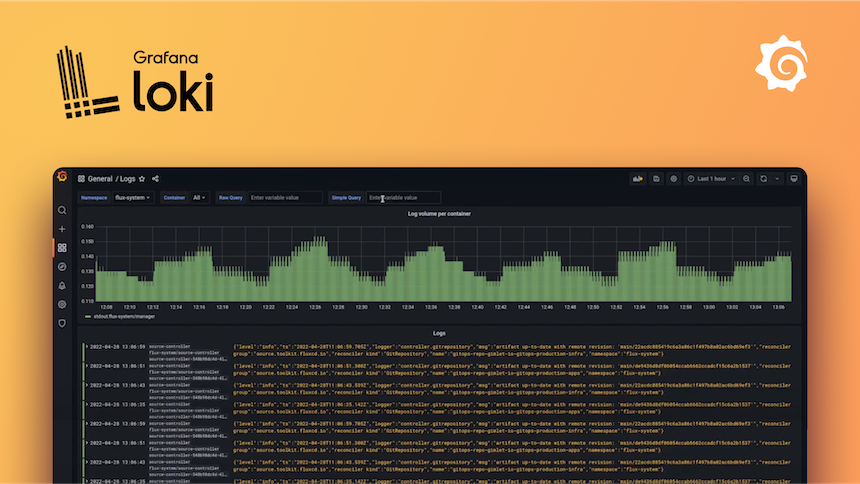

# Loki
  

 
Grafana Loki is a horizontally scalable, highly available, multi-tenant log aggregation system inspired by Prometheus. It is designed to be very cost-effective and easy to operate, as it indexes only metadata about your logs rather than the full text. This approach, combined with its integration with Grafana, allows you to seamlessly correlate your logs with metrics and traces to simplify troubleshooting.
 
 

# / Deployments

 

| Deployment               | Location           | Tags            | Status     | Url                                                              |
| ------------------------ | ------------------ | --------------- | ---------- | ---------------------------------------------------------------- |
| loki-dev-2-vm-1 | dev-2-vm |  | **active** | http://192.168.40.112  |

# References
-   [Github mirror](https://github.com/margusmuru/homelab-loki)
-   https://grafana.com/oss/loki/
